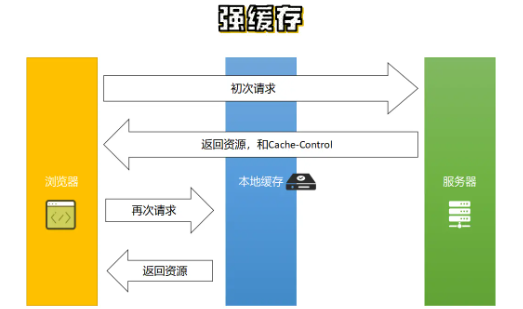
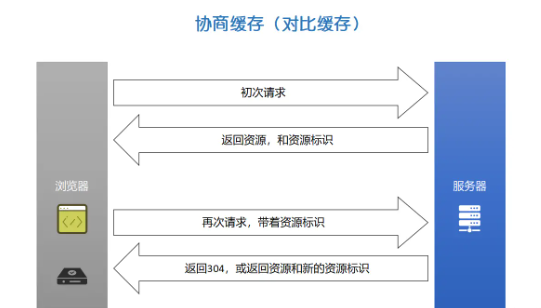
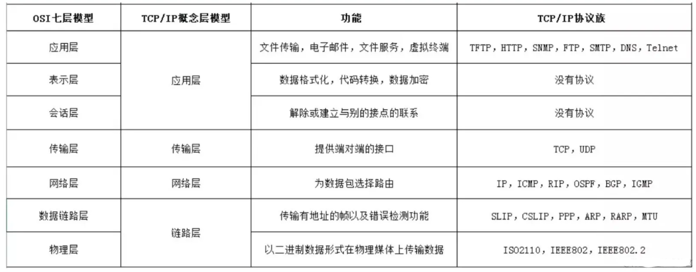
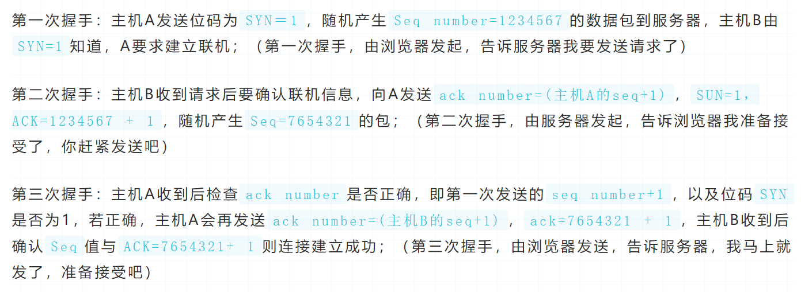

# 浏览器原理

## 浏览器输入URL会发生什么

浏览器主进程处理用户 URL 输入：

- 触发旧页面的 `beforeunload` 事件；
- 判断是搜索内容还是页面请求的 URL；
  - 如果是搜索内容，地址栏会使用浏览器默认的搜索引擎，来合成新的带搜索关键字的URL。
  - 如果判断输入内容符合URL规则，比如输入的是 `juejin.cn` 那么地址栏会根据规则，把这段内容加上协议，合成为完整的URL，如 `https://juejin.cn`。
- **浏览器主进程**把收到的 URL 转给**网络进程**；

网络进程处理 HTTP 请求：

- 构建请求；
- 查找缓存，有缓存就直接返回了；
- DNS (基于 UDP)解析，准备 IP 地址及端口号（递归查询，迭代查询），如果没有端口号，http默认80，https默认443；
- 等待 TCP 队列；
- 建立 TCP 连接，三次握手（为了确认客户端和服务端的接收和发送能力）；
- 如果是https请求 还有TSL，四次握手；
- 排队等待，最多可以发送6个http请求，发送 HTTP 请求（请求行 请求头 请求体）；
  - chrome 针对同一域名只能建立6个tcp链接，
  - 同一域名下，同一GET请求的并发数是1，也就是说上一个请求结束，才会执行下一个请求，否则置入队列等待发送；
  - 同一域名下，不同GET/POST请求的并发数量是6。当发送的请求数量达到6个，并且都没有得到响应时，后面的请求会置入队列等待发送

检查状态码

- 如果是301/302，则需要重定向，从Location自动中读取地址，重新进行第4步 ，如果是200，则继续处理请求。
- 200响应处理：检查响应类型`Content-Type`，如果是字节流类型，则将该请求提交给下载管理器，该导航流程结束，不再进行后续的渲染，如果是html则通知浏览器进程准备**渲染进程**准备进行渲染。
- 304 去查询浏览器缓存进行返回（协商缓存）
- http/1.1 默认是不会断开(keep-alive)
  - 断开 TCP 连接，四次挥手（接收完响应数据后才会断开 TCP 连接）；

准备渲染进程、提交文档、确认文档被提交

- **网络进程**收到响应头数据，将数据发送给**浏览器主进程**；

- 浏览器主进程收到网络进程传来的响应头数据，准备渲染进程；

  - **浏览器进程**检查当前url是否和之前打开的**渲染进程**根域名是否相同，如果相同，则复用原来的进程，如果不同，则开启新的**渲染进程**

- 准备好**渲染进程**后，**浏览器主进程**向**渲染进程**发起“提交文档”的消息；

- **渲染进程**收到**浏览器主进程**传来的“提交文档”消息，之后会与**网络进程**建立传输 HTML 页面数据管道；

- 当**网络进程**中的响应体接收完毕，通过**管道**将 HTML 页面数据传输给**渲染进程**；

- 当 HTML 页面数据传输完成后，**渲染进程**会返回“确认文档提交”消息给**浏览器主进程**；

- **浏览器主进程**收到“确认文档提交”消息后，就会更新浏览器界面的状态，比如安全状态、地址栏 URL、历史记录状态，并刷新 Web 页面；

渲染阶段

- **渲染进程**将 HTML 脚本解析成浏览器能识别处理的 DOM 树；

- **渲染进程**将 CSS 脚本解析成浏览器能识别处理的 `styleSheets`，标准化处理属性值，并完成各节点的样式计算；

- 创建布局树，忽略不可见的节点，进行布局计算，并将节点的布局信息重写回布局树；

- 对布局树进行分层，生成分层树（Layer Tree）；如一些复杂的`3D变换`、`页面滚动`，或者使用`z-indexing`做z轴排序等，为了更加方便地实现这些效果，渲染引擎还需要为特定的节点生成专用的图层，并生成一棵对应的图层树（LayerTree）

- 为每个图层生成绘制列表，并提交给**合成线程**；（每个图层有自己的绘制步骤）

- 合成线程进行分块，并在栅格化线程池中将图块转化为位图（含 GPU 栅格化）；（有的图层，太大了，需要滚动才能出现在视口中，这种就需要分块，没必要一次性渲染，影响性能！）

  - 通常，栅格化过程都会使用GPU来加速生成，使用GPU生成位图的过程叫快速栅格化，或者GPU栅格化，生成的位图被保存在GPU内存中。

- **浏览器主进程**viz组件收到合成线程的绘制指令 `DrawQuad`，先在内存中绘制页面，并最终显示在浏览器标签页上。

## 浏览器进程

**1️⃣进程与线程**

1. 进程：cpu**资源分配**的最小单位，进程享有**独立**内存地址空间，不同进程**不共享资源**
2. 线程：cpu**调度**的最小单位，一个进程可以有一个或多个线程，多个线程之间**共享进程的资源**

不同进程间需要进行进程间通信（IPC），线程共享进程资源所以通信很方便

**2️⃣浏览器中的进程**：浏览器是多进程的，每开一个标签页tab就相当于创建了一个进程，进程间互相独立，某个标签页挂了不影响其他

> 进程间通信：浏览器主进程和渲染进程通过**RendererHost**接口进行通信，由浏览器主进程的IO线程获取页面内容（通过网络请求或者本地缓存）通过**RendererHost**接口然后交给渲染进程，渲染进程对内容进行html、css解析，js脚本执行，页面渲染（这里只能会造成回流重绘），最后将结果给回浏览器主进程，主进程进行绘制。

1. 浏览器进程（Browser浏览器主进程），

   - UI线程：处理用户交互，分发任务给其他线程执行
   - IO线程：浏览器进程与其他进程进行进程间通信，下载渲染进程所需要的资源文件
   - File线程：读取磁盘文件，下载文件到磁盘
   - 数据库线程：进行一些数据库操作，如保存cookie到数据库

2. **渲染进程**（Renderer进程）

   > 渲染线程和js引擎线程是**互拆**的，JS执行会阻塞页面加载和渲染，但是可以用defer和async来进行异步加载执行。

   1. **渲染线程**：负责渲染浏览器界面，包括解析html，css，构建DOM树，Render树，布局和绘制等等
   2. **js引擎线程**：执行js脚本
   3. 事件触发线程：js执行到点击事件，异步触发回调，事件会添加到队列末尾，等js引擎空闲后执行
   4. 定时器线程：setTimeout，setInterval的计时是单独的线程计算的
   5. 异步http请求线程：axios，ajax啥的请求

3. GPU进程：3D绘制，将元素渲染从cpu转换为GPU加速

4. 网络进程：负责网络资源加载

5. 插件进程：每一个类型的插件对应一个进程

6. 音频进程：浏览器的音频管理

## web worker

**概念：**

**web worker**：在浏览器后台运行的独立worker线程，js运行是单线程的，js执行时间过长会阻塞页面，因此可以把复杂计算的js代码交给web worker运行，web worker还可以通过postMessage，onmessage和浏览器通信，解决大量计算对UI渲染的阻塞问题。

**特点：**

同源限制：worker运行的js文件和主线程的js文件要同源

DOM限制：worker线程不能读取网页的DOM对象，但是它也有navigator、location对象

通信：无法与主线程直接通信，通过postMessage，onmessage消息间接通信

脚本限制：不能执行alert()、confirm()方法，但可以发送AJAX请求

文件限制：work线程无法读取本地文件，脚本文件只能来自于网络

**应用场景：**

1、数学运算

复杂计算交给web worker来后台计算

2、图片处理

将图像分割成几个不同区域并推送到不同的worker线程来做计算，对图像进行像素级的处理，再把处理完的数据返回给主页面

3、大数据处理

现在的数据驱动开发模式，未来可能大数据处理也都转向前端

## Service Worker

**概念：**

相当于服务器和浏览器之间的中间人角色，也可以理解为一个代理服务器，它也是运行在浏览器后台的一个独立线程，客户端网站所有请求都需要通过Service Worker，然后转发给服务器，服务器返回也需要经过Service Worker，因此可以动态拦截请求。和浏览器内部缓存机制不一样，它可以让我们自由控制缓存哪些文件，如何匹配缓存，如何读取缓存，而且缓存是永久的(除非手动删除，或者容量超出限制)

**应用场景：**可以做离线缓存，消息推送post Message，网络代理

**特点：**

注册Service Worker的网站只能使用HTTPS协议（安全性问题）

因为基于Web Worker，也是不可访问操作页面DOM，完全异步，同步api不能在service worker使用

可以访问cachestorage和indexDB前端数据库

运行开发者自己控制管理缓存内容和版本

## 浏览器缓存

浏览器初次发送请求时，服务器收到请求后对资源文件做缓存设置，并返回资源，接着浏览器再次请求时，浏览器会先检查是否命中强缓存，如果命中，则直接从本地读取缓存，不会向服务器发送请求。如果强缓存没有命中，浏览器会携带缓存标识发送请求到服务器，通过缓存标识判断是否命中协商缓存，如果命中，服务器将请求返回，但不会返回资源，告诉浏览器从本地缓存读取资源，如果没有命中，服务器直接返回资源给浏览器。

### 强缓存



浏览器初次发送请求时，服务器收到请求后对资源文件做缓存设置，并返回资源，接着浏览器再次请求时，浏览器会先检查是否命中强缓存，如果命中，则直接从本地读取缓存，不会向服务器发送请求。

> 强缓存分为两种：响应头字段设置为Expires和Cache-Control，Expires是HTTP/1.0版本使用的，值是一个过期时间点(一个时刻，过了这个时刻就过期失效)，缺点是浏览器时间和服务器时间有可能不一致导致过期时间不准确。Cache-Control在HTTP/1.1中使用，值是过期时间（一个时间段，会倒计时，倒计时为0则失效），相当于倒计时。语法`Expires: Wed, 22 Nov 2019 08:41:00 GMT`、`Cache-Control:max-age=3600`

### 协商缓存



如果强缓存没有命中，浏览器会携带缓存标识发送请求到服务器，通过缓存标识判断是否命中协商缓存，如果命中，服务器将请求返回，但不会返回资源，告诉浏览器从本地缓存读取资源，如果没有命中，服务器直接返回资源给浏览器。

> HTTP1.0 ---> **Last-Modified**；HTTP1.1 ---> **Etag**
>
> 协商缓存主要用响应头Last-Modified或者Etag来做判断。`Last-Modified`是资源最后修改时间，它对应请求头为`If-Modified-Since`；Etag是资源唯一标识，是资源的hash值（用的md5算法），对应的请求头是`If-None-Match`，两个都是用来对比资源是否更新过，如果资源没更改，返回304，浏览器读取本地缓存，如果资源有更改，返回200，返回最新的资源。

**区别**： 强缓存命中，不会请求服务器，直接请求缓存；协商缓存命中，会请求服务器，不会返回内容，然后读取缓存。

## 浏览器缓存存储位置

缓存查找优先级：Service Worker -> Memory Cache -> Disk Cache

前面的没有命中才会接着查找下一个

浏览器对缓存的处理是根据第一次请求资源时**返回的响应头**来**决定是否缓存该资源**

浏览器每次发起请求时，都会先在浏览器缓存中查找该请求的结果和缓存标识；

浏览器每次拿到返回的请求结果都会将该结果和缓存标识存入浏览器缓存中。

### 1.Service Worker(上面已经介绍了)

### 2.Memory Cache

**概念：**

内存缓存：把资源缓存在**内存**中，内存缓存持续时间短，随着进程的释放而释放（如：关闭tab标签页），但是读取非常高效，一般缓存小容量资源。

> 当我们访问过页面以后，再次刷新页面，可以发现很多数据都来自于内存缓存，内存缓存中有一块重要的缓存资源就是preloader预加载指令（如：`<link rel = "prefetch">`）,可以用来做页面优化，一边解析js、css文件，同时请求资源。

### 3.Disk Cache

**概念：**

磁盘缓存：将资源缓存在磁盘中，容量大、读取缓慢、持续时间长，缓存大容量资源优先选用，绝大部分缓存来自于Disk Cache

> 一般不存储CSS文件，因为CSS加载一次就可以渲染，不需要频繁读取

### 4.Push Cache

**概念：**

推送缓存：HTTP2的内容，以上三种都没命中才使用，只存在与Session会话中，一旦会话结束则释放，缓存持续时间也很短，Chrome只有5分钟

### 用户行为对浏览器缓存的影响

所谓用户行为对浏览器缓存的影响，指的是用户在浏览器如何操作时，会触发怎样的缓存策略，主要分三种：

- **打开网页：**地址栏输入地址：查找disk cache中是否有匹配，如有则使用，如没有则发送网略请求。
- **普通刷新（F5）：**跳过强缓存，会检查协商缓存。因为TAB页没有被关闭，因此memory cache 是可用的，会被优先使用，其次才是disk cache。
- **强制刷新（Ctrl+F5）：**浏览器不使用缓存，直接从服务器加载，跳过强缓存和协商缓存，因此发送的请求头部均带有Cache-control：no-cache（为了兼容，还带了pragma：no-cache），服务器直接返回200和最新内容。

### 缓存种类：

常见且常用的存储方式主要有两种：cookie、webStorage（localStorage h和sessionStorage）

HTML5提供了两种客户端存储数据的API新方法，localstorage和sessionstorage，挂载在Window对象下。webStorage 是本地存储，数据不是由服务器请求传递的，从而它可以存储大量的数据，而不影响网站的性能。webStorage的目的是为了克服由cookie带来的一些限制，当数据需要被严格控制在客户端时，无须持续的将数据发给服务器。比如客户端需要缓存的一些用户行为和数据，或者从接口获取的一些短期内不会更新的数据。

**1.cookie：**

HTTP协议是无状态的，自身不对请求和响应之间的通信状态进行保存，因此诞生了cookie，服务器可以设置或者读取cookie信息，来维护用户与服务器会话的状态。它是服务器发给浏览器的一小段数据，会在浏览器下一次请求时携带并发送到服务器。cookie里存储着用户信息，当服务器检查cookie时，可以获取到客户端的状态。

- 使用场景
  - 会话状态管理（**登录状态**、购物车、游戏分数等）
  - 个性化设置（用户自定义设置、主题等）
  - 浏览器行为跟踪（如跟踪分析用户行为进行商品推荐等）

**2.localstorage**

localstorage用于存储一个域名下的需要永久存储在本地的数据，这些数据可以一直被访问，直到这些数据被删除。

特点：

- 保存的数据长期存在，除非清除浏览器缓存。下一次访问该网站时，网页可以直接读取以前保存的数据，
- 大小为5M左右
- 仅在客户端使用，不和服务端通信
- 接口封装较好

使用场景：

localstorage可以作为浏览器本地缓存方案，用来提升网页首屏渲染速度，根据第一次请求返回时，将一些不变的信息直接存储在本地。

读写操作：

```js
localstorage.setItem(key, value)  保存数据，key和value都必须是字符串类型
localstorage.getItem(key)  获取数据
localstorage.removeItem(key)  删除数据
localstorage.clear()  删除全部数据
```

**3.sessionStorage**

sessionStorage保存的数据用于浏览器的一次会话，当会话结束（通常是该窗口关闭），数据就会被清空；sessionStorage特别的一点在于，即便是相同域名的两个页面，只要他们不在同一个浏览器窗口打开，那么它们的sessionStorage内容便无法共享；localStorage在所有同源窗口都是共享的；cookie也是在所有同源窗口中都是共享的。除了保存的期限长短不同，sessionStorage与localStorage的属性和方法完全一样。

特点

- 会话级别的浏览器存储
- 大小为5M左右
- 仅在客户端使用，不和服务端通信
- 接口封装较好

使用场景

有效对表单信息进行维护，比如刷新时，表单信息不丢失。单页面应用较多，敏感账号一次性登录等。

读写操作

```js
sessionstorage.setItem(key, value)  保存数据，key和value都必须是字符串类型
sessionstorage.getItem(key)  获取数据
sessionstorage.removeItem(key)  删除数据
sessionstorage.clear()  删除全部数据
```

**🟢三者区别**

| 存储方式       | 作用与特性                                                   | 存储大小     | 数据有效期                                                   | API                                                     |
| -------------- | ------------------------------------------------------------ | ------------ | ------------------------------------------------------------ | ------------------------------------------------------- |
| cookie         | a.在所有同源窗口中都是共享的。b.存储用户信息，获取数据需要与服务器建立连接。c.可存储的数据有限，且依赖于服务器，无需请求服务器的数据尽量不要存放在cookie中，以免影响页面性能。d.可设置过期时间。 | 一般不超过4K | 一般由服务器生成，可以设置失效时间；若没有设置失效时间，关闭浏览器cookie就失效；若设置了时间，cookie就会存放在硬盘里，过期才失效。 | 需要自己封装，原生的cookie接口不够友好                  |
| localstorage   | a.在所有同源窗口中都是共享的。b.存储客户端信息，无需请求服务器。c.数据永久保存，除非用户手动清理客 户端缓存。d.开发者可自行封装一个方法，设置失效时间。 | 5M或更大     | 永久有效，窗口或者浏览器关闭也会一直保存，除非手动清除缓存。 | 原生接口可以接受，可以封装来对object和array有更好的支持 |
| sessionstorage | a.在同一个浏览器窗口是共享的，不同浏览器同一页面也是不共享的。b.存储客户端信息，无需请求服务器。c.数据保存在当前会话，刷新页面数据不会被清除，结束会话（关闭浏览器、关闭页面、跳转页面）数据失效。 | 5M或更大     | 仅在浏览器窗口关闭之前有效，关闭页面或浏览器就会被清除       | 原生接口可以接受，可以封装来对object和array有更好的支持 |

### 缓存小结

当浏览器要请求资源时，会先查看是否命中Service Worker缓存，没有就调用 Service Worker 的 fetch 事件响应 查看 memory cache 查看 disk cache。这里又细分： 如果有强制缓存且未失效，则使用强制缓存，不请求服务器。这时的状态码全部是 200，如果有强制缓存但已失效，使用协商缓存，比较后确定 304（直接使用缓存） 还是 200 发送网络请求，等待网络响应把响应内容存入 disk cache (如果 HTTP 头信息配置可以存的话) 把响应内容 的引用 存入 memory cache (无视 HTTP 头信息的配置) 把响应内容存入 Service Worker 的 Cache Storage (如果 Service Worker 的脚本调用了 cache.put())

## DNS域名解析

在发起HTTP请求前，需要知道访问网页的**IP地址**，一开始会先查找缓存，没找到的话浏览器会发送UDP包给DNS域名解析服务器

### **1.递归查询**

从主机到本地域名服务器（ISP域名服务器）的查询属于递归查询

递归查询过程，相当于查找（域名-IP地址的映射）缓存：

浏览器、本地系统host文件、路由器、本地域名服务器ISP都可能会有域名->IP的缓存


### 2.迭代查询

从本地域名服务器到其他DNS服务器的查询属于迭代查询，为什么不用递归查询，因为递归查询会耗费服务器性能。两个图一样的意思

<figure class="half"></figure>

### **3.DNS负载均衡**

网站访问量过大，那么在应答DNS查询时，DNS服务器会对每个查询返回不同的解析结果（IP地址），从而把请求访问引导到不同的服务器上去，从而达到负载均衡的目的。

### **4.DNS预解析**

对于大型网站，可能会发送多个不同服务器请求，那么就可以采用DNS与解析，提前解析，避免用到的时候才去解析，减少页面卡顿。`rel="dns-prefetch"`

```
<link rel="dns-prefetch" href="g.alicdn.com">
```

## 网络协议

### 1.OSI模型

应用层、表示层，会话层、传输层、网络层（路由器）、数据链路层（交换机）、物理层(网线、集线器)

### ２.TCP/IP模型

- 应用层：包括应用层、表示层、会话层
  - 常见基于**TCP协议**的应用层协议：**HTTP**（超文本传输协议）、**FTP**（文件传输协议）、**SMTP**（简单邮件传输协议）、**TELNET**（终端仿真协议）
  - 常见基于**UDP协议**的应用层协议：**DHCP**（动态主机配置协议）、TFTP（简单文件传输协议）

- 传输层：
  - **TCP**（传输控制协议）、**UDP**（用户数据报协议）

- 网络层：
  - IP/IPv6（互联网协议/互联网协议第六版）、ICMP（互联网控制信息协议）

- 链路层：数据链路层、物理层
  - ARP协议（地址解析协议）



### **💥3.三次握手**

**为什么需要三次握手？******主要是为了确认双方的接收和发送能力**

答：客户端和服务端要进行可靠传输，那么就需要**确认双方的接收和发送能力**。第一次握手可以确认**客服端的发送能力**（服务器收到了要求建立联机信息SYN=1、seq=X）,第二次握手，客户端收到服务端端SYN=1,Seq=Y就确认了服务端发送能力，ACK=X+1就确认了它的接收能力，第三次握手服务器接收到ACK=Y+1可以确认客户端的接收能力。不然容易出现丢包的现象。

SYN：位码；Seq是序列号（随机生成）；ACK是确认好，值等于当前收到的Seq+1

这个图描述得很好




**上面解释了为什么要三次握手，那为什么两次不行呢？**

假设只进行两次握手，客户端发起第一次连接请求，但是报文丢失了，服务器没收到，于是客户端得超时重传一次。服务器接收到了，通过两次握手建立了连接。数据传输完毕后，释放了连接。这是之前丢失的报文滞留在网络中，某个时间后又到达了服务端，此时服务端误以为客户端需要建立连接，然后返回确认报文给客户端，统一建立连接。这样只需要服务端确认就算建立连接的话，此时的客户端是不会回应刚刚服务器的确认报文的（因为这是它认为丢失的报文），那么就导致服务端一直等待客户端发送数据，浪费资源。

**SYN泛洪攻击？**

客户端在短时间内伪造大量不存在的IP地址，并向服务器不断地发送SYN包，服务器则回复确认包，并等待客户端确认，由于源地址不存在，因此服务器需要不断重发直至超时，这些伪造的SYN包将长时间占用未连接队列，队列满了后正常的连接就装不下了，引起网络拥塞和瘫痪

> 半连接队列：是用来放置未建立连接的请求的；全连接队列：装已经经过三次握手的请求

**💥四次挥手**

### 4.HTTP的各种版本对比

HTTP**1.1**相比HTTP**1.0**支持的特性：

- http1.0是无状态、无连接的应用层协议


- http1.1基于**文本解析**,把所有请求和响应作为纯文本
- http1.1加入了**缓存处理（强缓存和协商缓存）**
- http1.1拥有长连接，并支持请求**管道化**（`pipelining`），
- http1.1流控制基于**tcp连接**。

HTTP**2.0**相比HTTP**1.1**支持的特性：

- **新的二进制格式**：HTTP1.1 基于文本格式传输数据；HTTP2.0采用二进制格式传输数据，解析更高效。 
- **多路复用**：在一个连接里，允许同时发送多个请求或响应，并且这些请求或响应能够并行的传输而 不被阻塞，避免 HTTP1.1 出现的”队头堵塞”问题。 
- **头部压缩**，HTTP1.1的header带有大量信息，而且每次都要重复发送；HTTP2.0 把header从数据中分离，并封装成头帧和数据帧，使用特定算法压缩头帧，有效减少头信息大小。并且HTTP2.0在客户端和服务器端记录了之前发送的键值对，对于相同的数据，不会重复发送。比如请求a发送了所有的头信息字段，请求b则只需要发送差异数据，这样可以减少冗余数据，降低开销。 
- **服务端主动推送**：HTTP2.0允许服务器向客户端推送资源，无需客户端发送请求到服务器获取。
- **性能提升以及允许实现自己的流控制机制**

队头阻塞：HTTP1.1中使用长连接+管道化来实现并发请求，可以同时发送多个请求，但是服务器返回响应要按照顺序返回，这就导致了其中一个响应未处理完成，但是后面响应完成了也无法返回的情况，导致队头阻塞。

> 原因是因为http请求是没有序号标识的，乱序的响应和请求无法关联起来，要满足请求响应一一对应必须按请求顺序返回响应

**HTTP2.0多路复用**：所有通信只需要在一个TCP连接上进行，而且真正实现了请求的并发

所以HTTP2.0采用多路复用的方法，其中引入了二进制帧、消息、数据流等概念。每一个TCP连接上可以有多个**流**，一个流里有多个**消息**，每一个**请求/响应**被称为消息，每个消息被拆分成一个或多个帧，一般分为头部帧和数据帧，应该是把请求头、响应头、请求体、响应体切分了，每个帧会有一个字段记录流ID（Stream ID，每个流都有ID），一个流会包含多个请求或者响应，发送的时候，每个流可以乱序发送，但同一个 Stream ID 的帧一定是按顺序传输的。二进制帧到达后对方会将 Stream ID 相同的二进制帧组装成完整的**请求报文**和**响应报文**。当然，在二进制帧当中还有其他的一些字段，可以实现了**优先级**（让服务端先处理重要资源）和**流量控制**等功能。

**但是**，TTTP2.0只解决了应用层HTTP上的队头阻塞，没有解决传输层TCP上的阻塞，之后就出现了基于UDP的quic协议了

> 为什么要使用二进制帧：二进制帧传输更快，分帧可以有自己的报文头，存储流ID
>
> 为什么要用流：不同的流1，2，3，4，5，我可以乱序发送3，2，5，1，4，返回的时候我可以按照流ID对应获取数据，这样就解决了HTTP1.1请求响应不匹配的问题
>
> 为什么同一个流的帧要有序：因为二进制帧组装成完整的**请求报文**和**响应报文**的时候，帧是没有序号的，因此需要保持有序，才能组装成原来的样子。

quic协议

### 5.http与https的区别

- 相同点：两者都是应用层协议，都基于TCP/IP协议传输数据

- 不同点：

  - **http**：超文本传输协议，**明文**传输，基于请求和响应的无状态的协议，端口号**80**

  > 无状态是什么意思：协议对于交互性场景没有记忆能力

  - **https**：安全版的http，在http下加入了**SSL层**，**密文**传输；主要作用是①建立一个信息安全通道，保证数据传输的安全，②确认网站的真实性。端口号**443**

  > 缺点：多次握手 页面加载慢，连接缓存不如http，开销、功耗大，ssl安全计算消耗服务器cpu资源

- **https的工作原理/https的加密过程**

  步骤：目标是为了交换会话密钥，利用数字证书和非对称加密实现

  > ​	假设服务器网站公私钥 A 和 a  会话密钥 B

  1. 客户使用https的URL访问服务器，要求与服务器建立SSL连接。
  2. 服务器收到客户端请求后，会将网站的证书信息（证书中包含**服务器网站的公钥A**）传送一份给客户端。
  3. 客户端收到证书并验证证书合法性，接着与服务器开始协商SSL连接的安全等级。
  4. 客户端根据双方同意的安全等级，建立**会话密钥B**，然后利用**服务器的公钥A**将**会话密钥B**加密，并传送给服务器。
  5. **服务器利用自己的私钥a**解密出**会话密钥B**。
  6. 服务器利用**会话密钥B**加密与客户端之间的通信。

### 6.网络攻击XSS CSRF

**Xss(cross-site scripting) 攻击**：全称跨站脚本攻击，攻击者利用漏洞在网站中注入恶意代码，目的是盗取cookie、storage、token泄漏，如论坛中放一个钓鱼链接获取cookie信息，或者加入恶意表单，获取信息

- 防范方法
  - 内容安全策略：①入参字符过滤，②出参进行编码，③入参长度限制

**CSRF (Cross Site Request Forgery)攻击**：跨站请求伪造。CSRF 攻击是攻击者借助用户的 Cookie 骗取服务器的信任，以用户名义伪造请求发送给服务器。如：在请求的 url 后加入一些恶意的参数

- 防范方法
  - Referer Check：在http请求头中有一个字段叫做 Referer, 它记录了该 HTTP 请求的来源地址。通过 Referer Check, 可以检查是否来自合法的 “源”。
  - 添加 token 验证：在 HTTP 请求中以参数的形式加入一个随机产生的 token，并在服务器端建立一个拦截器来验证这个 token，若请求无 token 或者 token 不正确，则认为可能是 CSRF 攻击而拒绝该请求。
  - 验证码：验证码会强制用户必须与应用进行交互，才能完成最终请求，但是也不能给网站所有的操作都加上验证码，所以只能作为防御 CSRF 的一种辅助手段，而不能作为最终的解决方案

### 7.cookie 与 session

> 由于HTTP协议是无状态的协议，需要用某种机制来识具体的用户身份，用来跟踪用户的整个会话。常用 的会话跟踪技术是cookie与session。

**Cookie**

cookie就是由服务器发给客户端的特殊信息，存储在客户端，每次向服务器发送请求携带cookie(放在请求头里)，服务器分析cookie得到客户端特有信息，动态生成相应内容。(网站的登录界面中“请记住我” 这样的选项，就是通过cookie实现的)

Cookie工作流程：

1. servlet创建cookie，保存少量数据，发送给浏览器。 
2. 浏览器获得服务器发送的cookie数据，将自动的保存到浏览器端。 
3. 下次访问时，浏览器将自动携带cookie数据发送给服务器。

**session**  (sessionID存储在Cookie中)

浏览器请求服务器访问web站点时，服务器先检查客户端请求是否带有sessionID，如果包含则说明以前创建过session，直接安装sessionID把该session检索出来使用，如果不包含则创建一个session，并生成一个相关联独一无二的sessionID存放到cookie中，并返回给客户端保存。之后每一次请求都会带着sessionID，服务器根据这个sessionID就可以找到对应session，以此来达到共享数据。

**Cookie和Session的区别** 

1、作用范围不同：Cookie 保存在**客户端**(相当于浏览器)，Session 保存在**服务器端**。 

2、有效期不同：Cookie 可设置为**长时间保持**，比如我们经常使用的默认登录功能，Session 一般**失效时间较短**，客户端关闭或者 Session 超时都会失效。 

3、隐私策略不同：Cookie存储在客户端，容易被窃取；Session 存储在服务端，安全性相对 Cookie 要好一些。

 4、存储大小不同：单个 Cookie 保存的数据不能超过 4K；对于 Session 来说存储没有上限，但出于 对服务器的性能考虑，Session 内不要存放过多的数据，并且需要设置 Session 删除机制。

### 8.get和post的区别

（1）post相对更安全（不会作为url的一部分，不会被缓存、保存在服务器日志、以及浏览器浏览记录中）

（2）post发送的数据更大（get有url长度限制）

（3）post能发送更多的数据类型（get只能发送ASCII字符）

（4）post比get慢，get产生有一个数据包，post产生两个数据包（先发送请求头，然后返回100continue，再发送请提体）

（5）post用于修改和写入数据，get一般用于搜索排序和筛选之类的操作（淘宝，支付宝的搜索查询都是get提交），目的是资源的获取，读取数据